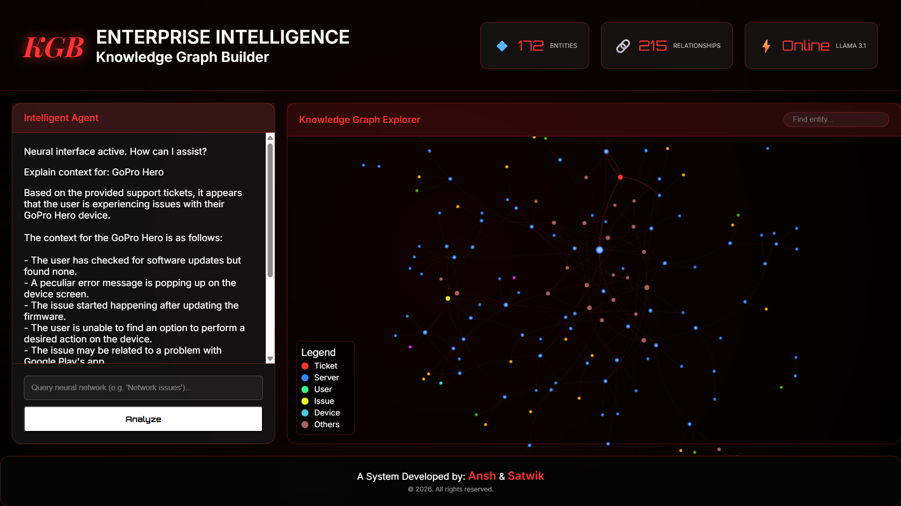

# 🧠 (KGB) AI Knowledge Graph Builder for Enterprise Intelligence
### **Developed as part of the Infosys Springboard Internship** 
### **Authors:** Satwik Panchagnula, Ansh Pratap Singh
<a href="https://kgb-12g3.onrender.com/"></a>
[]()
[]()
[]()
[]()
[]()
[]()

----

# 📖 Project Overview

This project builds an enterprise-level **AI-powered Knowledge Graph system** from structured and unstructured customer support data. 

The system extracts entities and relationships from support tickets, constructs a **dynamic knowledge graph**, and enables **intelligent semantic search with a Retrieval-Augmented Generation (RAG) pipeline**. By moving completely to the cloud, it provides high-speed automated troubleshooting responses via an interactive graph dashboard.

---

# 🎯 Objective

To transform enterprise support ticket data into a scalable, cloud-native knowledge graph that enables:

- **Relationship-based analysis** to uncover hidden connections.
- **Intelligent troubleshooting** driven by high-speed LLM inference.
- **Semantic search** over vast amounts of support tickets.
- **AI-assisted IT support responses** for actionable intelligence.

---

# 🏗 Project Architecture (Cloud-Native)

> *The journey of a support ticket from raw data to an interactive neural graph.*

```text
Raw Dataset  
      ↓
Data Cleaning (Pandas)
      ↓
Structured Triple Extraction
      ↓
LLM-based Entity Extraction 
      ↓
Merge Structured + LLM Triples
      ↓
Neo4j Graph Construction (AuraDB Cloud)
      ↓
Embedding Generation (Hybrid: Local PyTorch OR Serverless Hugging Face API)
      ↓
Vector Database (FAISS)
      ↓
Semantic Search
      ↓
Retrieval-Augmented Generation (Groq API + Llama 3.1)
```

---

# 🚀 Technologies Used

- **Python & Pandas** (Data Processing)
- **Sentence Transformers & FAISS** (Vector Database & Embeddings)
- **Hugging Face Inference API** (Serverless Embedding for Cloud Deployment)
- **Groq API / Llama 3.1** (High-Speed Cloud LLM for Intelligent Assistant)
- **Neo4j AuraDB** (Cloud Graph Database)
- **Flask** (Backend API)
- **Vis.js** (Frontend Graph Visualization)
- **GitHub** (Version Control)

---

# ✅ Milestone 1 – Data Ingestion & Preprocessing

### Tasks Completed
- Data cleaning using Pandas.
- Removal of null values and duplicates.
- Data normalization and feature enrichment.
- Processed dataset generation.

### Output
```text
cleaned_tickets.xlsx
```

---

# ✅ Milestone 2 – Entity Extraction & Graph Construction

## Step 1: Structured Triple Extraction
Extracted **entity–relationship–entity triples** from structured columns.
*Example triples:*
```text
Customer → RAISED → Ticket
Ticket → HAS_SEVERITY → Severity
Ticket → SUBMITTED_VIA → Channel
```
**Output:** `structured_triples.csv`

## Step 2: LLM-Based NER
Used LLMs to extract semantic relationships from raw ticket descriptions.
*Example triples:*
```text
(Dell XPS, EXPERIENCING, Not turning on)
(Dell XPS, REQUIRED_ACTION, Troubleshoot power issues)
```
**Output:** `llm_triples.csv`

## Step 3: Graph Construction (Neo4j Cloud)
- Combined structured and LLM-generated triples.
- Inserted triples into **Neo4j AuraDB** using the Python Neo4j driver.
- Constructed graph nodes and relationships.

### Graph Statistics
```text
Graph Statistics (Sample Run – First 20 Rows)
Nodes: ~160+
Relationships: ~240+

Note: Running the pipeline on the full dataset generates a significantly larger, interconnected knowledge graph.
```

## Step 4: Graph Validation
Validated graph integrity using Cypher queries directly in the cloud.

*Count Nodes & Relationships:*
```cypher
MATCH (n) RETURN count(n);
MATCH ()-[r]->() RETURN count(r);
```

---

# ✅ Milestone 3 – Semantic Search & RAG Pipeline

## Objective
Enable intelligent search and automated troubleshooting responses by integrating **semantic search** with a **Retrieval-Augmented Generation (RAG) pipeline**.

## Step 1: Embedding Generation
Ticket descriptions were converted into **vector embeddings** using `all-MiniLM-L6-v2`. This allows the system to understand **semantic similarity**.
> *Example:* Even if a ticket says *"Device fails to power on"*, it successfully retrieves matches for the user query *"laptop not turning on"*.

## Step 2: Vector Database (FAISS)
Embeddings were stored in a **FAISS vector database** for rapid similarity search.
| File | Description |
|-----|-------------|
| `vector_index.faiss` | Stores ticket embeddings |
| `ticket_texts.pkl` | Stores ticket descriptions mapped to vectors |

## Step 3: Semantic Search
User queries are converted into embeddings and matched against the FAISS index to retrieve highly contextual documents even without exact keyword matches.

## Step 4: Retrieval-Augmented Generation (RAG) via Groq API
The retrieved tickets are used as **context for the Intelligent Assistant**. By migrating to the **Groq API**, the system achieves near-instantaneous inference using Llama 3.1.

```text
User Query → Query Embedding → Semantic Search (FAISS) → Retrieve Relevant Tickets → Context Injection → LLM Response (Groq API)
```

---

# ✅ Milestone 4: Enterprise UI & Deployment (Completed)

## Step 1: Flask Backend Integration
Successfully integrated the entire RAG pipeline into a robust Python Flask backend, acting as the bridge between Neo4j, FAISS, and the Groq API.

## Step 2: Glassmorphic Intelligence Dashboard
Developed a 20/70/10 Glassmorphic UI using Vis.js for interactive, bi-directional graph exploration. Clicking a node automatically triggers the Groq AI, and AI responses auto-zoom the graph.

## Step 3: Hybrid Cloud Deployment Architecture
<p>Removed the need for local desktop applications. Added a comprehensive `requirements.txt` for streamlined deployment to cloud hosting environments.
Engineered an environment-aware hybrid embedding system to bypass strict free-tier memory limits (512MB RAM).<br>
-> Local Environment: Initializes high-speed local PyTorch SentenceTransformers for zero-latency desktop presentations.<br>
-> Cloud Environment: Automatically detects Render deployment and seamlessly shifts to the serverless Hugging Face Inference API, dropping RAM footprint by ~70% and ensuring 100% crash-free uptime.</p>
---

# ⚙️ Installation & Setup (Cloud-Native)

*No heavy desktop applications (like Neo4j Desktop or local Ollama) are required. The entire system connects to cloud infrastructure.*

## 1️⃣ Clone the Repository
```bash
git clone [https://github.com/panchagnula-satwik/AI-Knowledge-Graph-Builder.git](https://github.com/panchagnula-satwik/AI-Knowledge-Graph-Builder.git)
cd AI-Knowledge-Graph-Builder
```

## 2️⃣ Create Virtual Environment
```bash
python -m venv .venv

# Activate environment (Windows)
.venv\Scripts\activate

# Activate environment (Mac/Linux)
source .venv/bin/activate
```

## 3️⃣ Install Dependencies
```bash
pip install -r requirements.txt
```

## 4️⃣ Cloud Configuration Setup (`.env`)
Create a `.env` file in the root directory to connect the application to the Groq LLM API and Neo4j AuraDB.
```env
# Groq API for the Intelligent Assistant
GROQ_API_KEY=your_groq_api_key_here

# Hugging Face API for Serverless Cloud Embeddings
HF_API_KEY=your_huggingface_read_token

# Neo4j AuraDB Cloud Connection
db_Url=neo4j+s://<YOUR_INSTANCE_ID>.databases.neo4j.io
NEO4J_USERNAME=neo4j
NEO4J_PASSWORD=your_aura_password

# Deployment Port
PORT=10000

#Best suitable Python version
PYTHON_VERSION=3.11.8

```

## 5️⃣ Launch the Enterprise System
```bash
python app/app.py
```

---

# 📁 Project Structure

```text
AI-Knowledge-Graph-Builder
│
├── app
│   ├── static/             # CSS styling and Vis.js graph logic
│   ├── templates/          # Glassmorphic HTML Dashboard
│   └── app.py              # Main Flask application & API routes
│
├── data
│   ├── raw                 # Original ticket datasets
│   ├── processed           # Cleaned Excel & CSV triples
│   ├── vector_index.faiss  # Semantic search database
│   └── ticket_texts.pkl    # Serialized text mappings
│
├── scripts
│   ├── push_to_neo4j.py    # Injects triples to AuraDB
│   ├── build_vector_index.py
│   └── semantic_search.py
│
├── requirements.txt        # Production dependencies
└── README.md
```

---

# 📊 Current Status

```text
Milestone 1 ✅ Completed
Milestone 2 ✅ Completed
Milestone 3 ✅ Completed
Milestone 4 ✅ Completed
```

---

# 🤖 Example Interaction & Final Outcome

**User Query in Intelligent Agent:**
> *"My laptop battery drains quickly."*

**Generated Cloud Response (Groq API):**
> 1. Check battery health.
> 2. Update power management drivers.
> 3. Reduce background applications.
> 4. Adjust power settings.
> 5. Replace battery if necessary.

# Project Preview



# Architecture Diagram


## Final Outcome
The system functions as a fully cloud-native, **AI-powered IT support ecosystem** capable of:
- Understanding natural language queries.
- Performing semantic search over support tickets.
- Retrieving relevant troubleshooting cases.
- Generating high-speed, intelligent repair recommendations via a sleek, interactive neural interface.

---
# 📌 Future Work
- Advanced graph analytics and historical time-series filtering.
- Multi-tenant enterprise deployment.
- Integration with live ticketing systems (ServiceNow/Jira).
