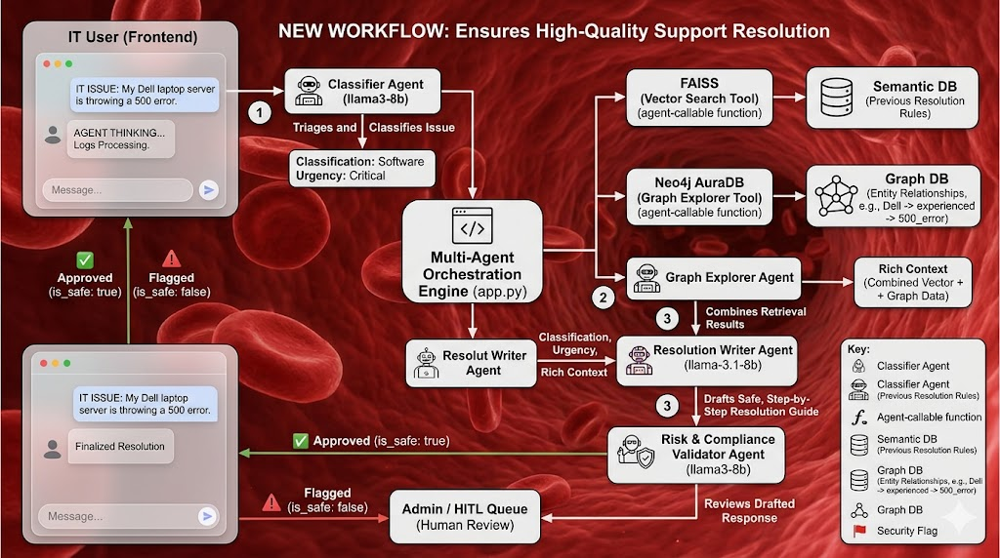

## Step 3: Graph Construction (Neo4j Cloud)
- Combined structured and LLM-generated triples.
- Inserted triples into **Neo4j AuraDB** using the Python Neo4j driver.
- Constructed graph nodes and relationships, with node labels (`Ticket`,
  `Device`, `User`, `Issue`, `Entity`) inferred automatically from entity names.

### Graph Statistics
```text
Graph Statistics (Sample Run – First 20 Rows)
Nodes: ~160+
Relationships: ~240+

Note: Running the pipeline on the full dataset generates a significantly larger, interconnected knowledge graph.
```

## Step 4: Graph Validation
Validated graph integrity using Cypher queries directly in the cloud.

*Count Nodes & Relationships:*
```cypher
MATCH (n) RETURN count(n);
MATCH ()-[r]->() RETURN count(r);
```

---

## 🏗 Architecture



---
